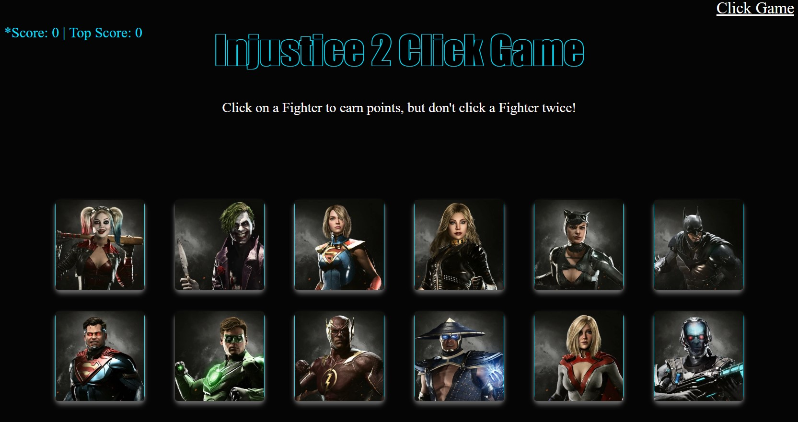

# reactClickGame

## To view deployed version, _**[click here!](https://lit-bayou-45265.herokuapp.com/)**_

Time to test your memory with characters from the video game 'Injustice 2'.
The Player must Click on each character once to win the game. But don't click on a character twice, or it's game over! The fighter cards will shuffle after each click and if the same image is clicked twice, before the game finishes, the game will restart. The objective is to beat your highest score or to click all 12 images in a row and become the 'reactClickGame Champion!' This was built with React. Give it a try, and have some fun. The link is listed above.
 
 
 

### The Game: 

 
 

### Technologies used:

- React
- CSS
- Bootstrap/Reactstrap
- Mongoose
- HTML5
- Javascript/ES6
- JSON

### Assignment Instructions:

- Check out the example, and study the app's basic functionality.

- Create a new React application using Create React App.

- The application should render different images (of your choice) to the screen. Each image should listen for click events.

- The application should keep track of the user's score. The user's score should be incremented when clicking an image for the first time. The user's score should be reset to 0 if they click the same image more than once.

- Every time an image is clicked, the images rendered to the page should shuffle themselves in a random order.

- Once the user's score is reset after an incorrect guess, the game should restart.

- When complete, the application should be deployed

#### File Structure

- See readme2.md
